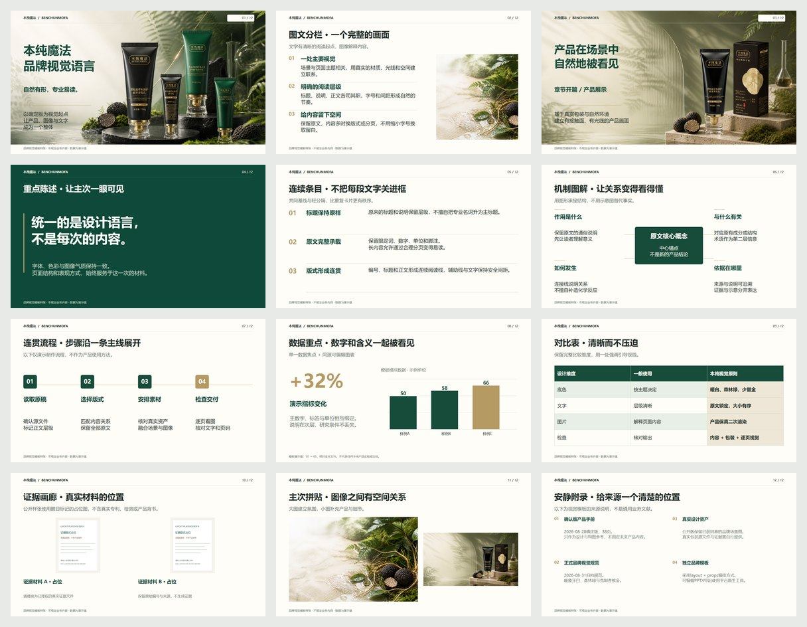

# 本纯魔法 · Dashi PPT

**自然有形，专业易读。** 为本纯魔法 / 植润色制作品牌演示、产品手册与培训课件的 AI Skill。

HTML 演示 → 浏览器编辑与保存 → 导出原生可编辑 PPTX / 静态 PDF。


[English](README.en.md) · [功能与边界](#功能与边界) · [安装](#安装) · [快速开始](#快速开始) · [环境与导出](#环境与导出) · [更新记录](CHANGELOG.md)

> 当前版本 **v1.0.0 · 2026-09-09**。公开版保留确认版编辑器、品牌配色、12类版式和获准公开的品牌场景图。仅移除私有项目路径、真实专利与检测证据；证据页使用明确标注的占位材料。它不是 Dashi 官方主题、官方分支或通用 PPTX 导入器。

## 你会得到什么

- 暖象牙白、森林绿、克制香槟金的本纯视觉语言；不强制统一业务内容或章节顺序。
- 12类声明式版式：封面、图文分栏、章节、重点陈述、连续条目、机制图解、流程、大数据、对比表、证据画廊、拼贴、参考附录。
- 银白风格三栏编辑器，右侧“样式／排列／页面”分类和轻动效。
- 文字、形状、图片编辑；字体、粗体、斜体、下划线；页底色、填充、描边颜色与粗细；插图、复制、删除和图层顺序。
- 自由变换浮层：九点参考位置、尺寸百分比、等比缩放、旋转、翻转、画布缩放控制点。
- 圆角矩形滑块 + 数值半径调节；保存、撤销/重做和导出共用同一场景数据。
- 原文保留与溢出检查。字多时调整版式或在获得允许后分页，不擅自删减文字。



## 安装

先下载本仓库 ZIP 并解压，或使用 Git：

```sh
git clone https://github.com/Midnight98-lin/benchun-dashi-ppt.git
```

把 **skills/benchun-dashi-ppt** 整个文件夹复制到 Codex 的 skills 目录。不要只复制 SKILL.md，也不要把整个仓库当成技能文件夹。

- 默认目录：用户主目录下的 `.codex/skills/`。
- 配置了 `CODEX_HOME` 时，放入其 `skills/` 子目录。
- 已有同名技能时先备份旧目录，再用本版本完整替换；不要覆盖个人未备份的修改。
- 安装后在新任务中选择 `$benchun-dashi-ppt`，或明确写出技能名称。

本仓库没有发布 npm 包，**不要使用 `npx benchun-dashi-ppt`**。

## 快速开始

### 1. 直接让 AI 使用

> 使用 $benchun-dashi-ppt，根据附件制作本纯品牌演示。保留全部原文，可以合理分页。先生成可编辑 HTML，打开浏览器编辑，保存确认后导出 PPTX 和 PDF。产品包装必须使用我提供的正式资产进行保真二次渲染。

只优化旧稿：

> 使用 $benchun-dashi-ppt 美化这份 PPT，不改正文，不替换数值和证据。先锁定原文，优化排版、图片和图解，并逐页核对。

其他 AI 工具可以阅读技能说明，但不能因此视为已支持全部平台依赖和导出能力。没有本纯私有项目仓库时，仅使用本仓库视觉规则及当次用户提供的材料，不猜测私人路径或产品事实。

### 2. 不通过 AI，先运行样张

以下命令在仓库根目录执行，需要 Node.js 20 或更高版本：

```sh
node skills/benchun-dashi-ppt/scripts/render.mjs --list
node skills/benchun-dashi-ppt/scripts/render.mjs skills/benchun-dashi-ppt/assets/example.goal.json work/demo
node skills/benchun-dashi-ppt/scripts/serve.mjs work/demo --port 5368
```

打开终端实际返回的本地地址（通常是 http://127.0.0.1:5368/ ）。服务使用本地回环地址，不是公网分享链接；端口占用时换空闲端口。关闭终端会停止该服务。

生成物：`work/demo/scene.json` 为可编辑场景，`index.html` 为独立演示。填写自己的内容前，复制样例 JSON 到工作目录；图片路径相对该 JSON 所在目录，迁移时同步修正素材路径。

### 3. 编辑、保存与导出

1. 左侧切页，中央选中对象，右侧修改属性。
2. “添加形状”插入矩形、圆角矩形、椭圆、三角形、箭头或线；“插入图片”选择 PNG/JPEG/WebP。
3. 圆角矩形选中后，在样式中调整“圆角半径”。自由变换点击按钮展开。
4. 在线自动保存，也可点击“保存”。确认已保存后再刷新或导出。
5. 点击“导出”，选择 HTML、PPTX 或 PDF；文件生成后通过下载入口保存。

**浏览器编辑后，以已保存的 scene.json 为主稿，不要重新运行旧 goal.json 覆盖人工修改。** 离线 HTML 无法直接写回原文件，需下载编辑后的 HTML 才算保存。离线可演示、编辑与打印 PDF；PPTX 需本地服务及相应依赖。

## 环境与导出

| 功能 | 条件 |
| --- | --- |
| 生成 HTML / 启动编辑器 | Node.js 20+，基础链路不要求 npm install |
| 原 PPTX 文字锁定与核对 | Python 3，脚本仅用标准库 |
| PDF 文件导出 | Playwright 及可运行的 Chromium/Edge |
| 原生可编辑 PPTX | Codex 工作区提供的 @oai/artifact-tool，及 presentations 技能终检工具 |
| 最終 PPTX 校验 | 对应平台 Python 依赖、字体、包结构与再导入工具 |

编辑器的功能入口不代表机器已经具备全部导出环境。**公开仓库不捆绑 @oai/artifact-tool、Codex 平台运行时、商业字体或第三方专有引擎。** 单独下载仓库即可运行基础 HTML；不能保证普通 Node 环境直接导出 PPTX。

在支持的 Codex 环境中，让 AI 调用工作区依赖查询并配置：

- `BENCHUN_NODE_MODULES`：包含所需依赖的 node_modules 目录。
- `PRESENTATIONS_SKILL_DIR`：当前 presentations 技能根目录。
- `RUNTIME_PYTHON`：具备对应校验依赖的 Python。
- `BENCHUN_BROWSER`：可选，Chromium/Edge 可执行文件路径。

完整命令和恢复方法见 [运行手册](skills/benchun-dashi-ppt/references/runtime.md)。Windows 当前环境已测试；其他系统的字体、浏览器路径和平台导出链路需另行验证。

## 功能与边界

- PPTX 中支持的文字、形状、表格和图表使用原生对象；照片与产品场景仍是图片。PDF 是静态文件。
- 目前不支持通用 PPTX 浏览器导入、新增页面、逐字富文本、透视扭曲、自由四角变形或任意自定义路径。
- 不承诺跨机器字体和排版完全相同；未嵌入字体，必须在目标设备核验。
- 专业数据不得改值，机制图必须有依据；生成图不能冒充检测报告、专利或证书。
- 产品包装按真实 SKU 二次渲染；禁止贴图式合成、改写标签或把100g缩小冒充30g。详细规则见 [素材与包装](skills/benchun-dashi-ppt/references/asset-workflow.md)。
- 公开样张里的数值仅为版式演示，不构成产品功效结论；证据占位图必须替换为有权使用的真实材料后才可用于实际文件。

## 仓库结构

```text
skills/benchun-dashi-ppt/
  SKILL.md       技能入口
  agents/        技能显示名称与调用提示
  assets/        品牌场景、样例、色彩与编辑器
  references/    视觉规则、运行说明、验收与素材边界
  scripts/       模板生成、服务、导出、原文核对及测试
docs/            编辑器预览与发布说明
```

## 验证

```sh
node skills/benchun-dashi-ppt/scripts/test-runtime.mjs
node skills/benchun-dashi-ppt/scripts/test-editor-api.mjs
```

它们检查12类版式、原文溢出与素材/数据约束，以及保存、修订冲突、重启和基本安全边界。视觉检查及导出检查不能由这两条命令代替。

## 使用与权利说明

本项目借鉴 Dashi 的声明式编排方式，是独立品牌实现，不是官方扩展，不包含其专有源码或私有导出API。第三方图标声明见 [THIRD_PARTY_NOTICES.md](THIRD_PARTY_NOTICES.md)。

仓库当前**未指定通用代码开源许可证**。公开可下载不等于授予无限制再分发、商标使用或素材转售权；本纯名称、Logo与品牌图片仍受各自权利约束。请勿将品牌示例作为其他品牌的包装或产品背书。后续如需明确开源协议，应由权利人选择，不自动套用参考仓库的许可证。
